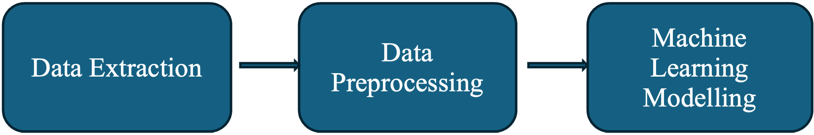
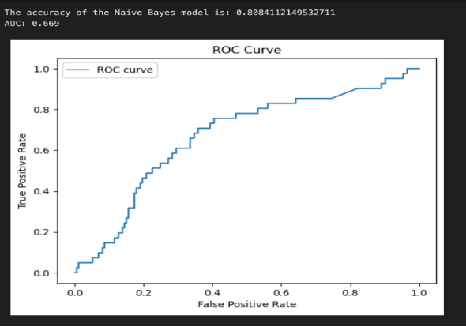
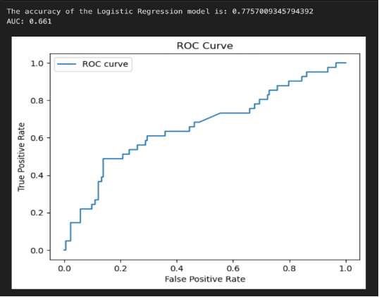
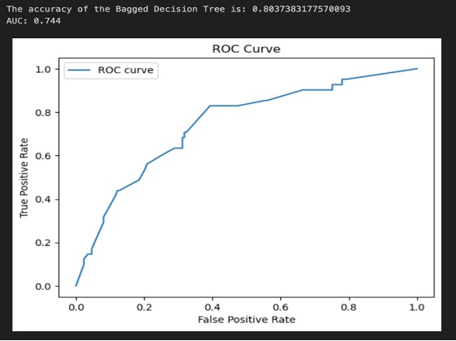
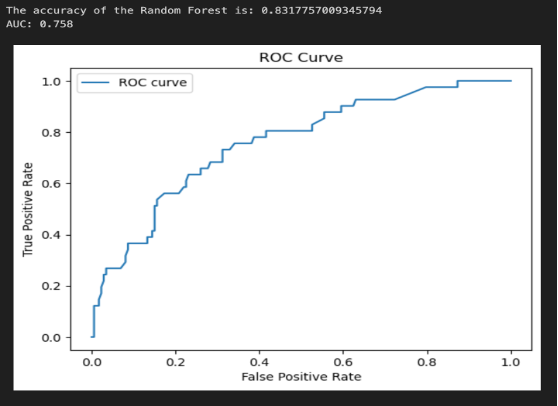
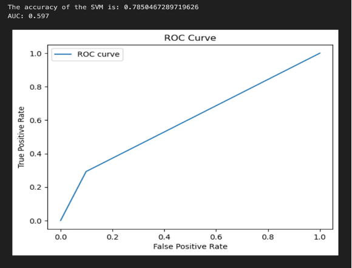
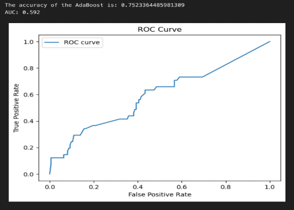
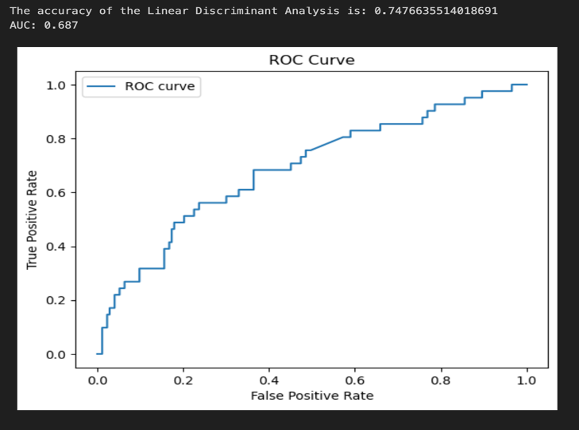
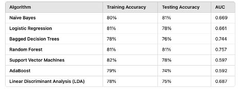

# Text-Analysis-using-Python

### Detecting Hate Speech against Women using Supervised Machine Learning Algorithms on The Red Pill Forum.

## Natasha Sharma
### Text Analysis 

*Abstract:*

The increase of hate speech targeting women on online platforms presents a significant societal challenge, particularly evident in forums such as The Red Pill Forum. This research addresses this issue by employing a combination of supervised machine learning methodologies to identify instances of hate speech directed towards women within the discourse of The Red Pill Forum's comment threads.

Our study outlines an approach that includes preprocessing, data extraction, and machine learning modeling. We collected a corpus of 1068 comments from The Red Pill Forum using the BeautifulSoup web scraping technique, and we tagged them carefully to identify hate speech content. Further preprocessing steps included lemmatization, tokenization, and part-of-speech filtering. We used a rigorous training and evaluation process was employed for seven supervised machine learning algorithms: Naïve Bayes, Logistic Regression, Bagged Decision Trees (Bagging), Random Forest, Support Vector Machines (SVM), AdaBoost, and LDA.

Based on our research, Random Forest was the most effective supervised classifier for identifying hate speech on The Red Pill Forum, with the highest classification accuracy (81%) and area under the curve (AUC) value (0.757). Nonetheless, the study recommends that future efforts expand the dataset and investigate a wider range of unsupervised machine learning methodologies to improve our comprehension and ability to identify hate speech directed at women in online forums.

This study significantly contributes to ongoing initiatives to reduce the dissemination of hate speech and promote a more welcoming and equal online community for all users.

Keywords: Hate Speech Detection, Supervised Machine Learning, Natural Language Processing (NLP), Text Analysis

1. Introduction

Our understanding of the world has drastically changed due to widespread Internet access. Social media, which comes in various forms, including online gaming platforms, dating applications, online forums, online news sources, and social networks, is one of the offspring of the World Wide Web. Different online networks have different goals in mind: sharing opinions on social media (like Facebook and Twitter), connecting with businesses (like LinkedIn), sharing images on social media (like Instagram and YouTube), dating (like Meteor), and so on. But they all share the same goal, which is to bring people together. (Pereira-Kohatsu et al., 2019)

However, thousands of people debated that these online platforms are frequently disseminating hate speech by social media users who voice their opinions on contentious issues. Brexit, the refugee crisis, and the trade war are a few instances of such divisive subjects. (Modha et al., 2020)

Any abusive writing or intimidating language that expresses bias against a specific group based on that group's race, religion, political affiliation, or other characteristics is referred to as "hate speech." (Adoum Sanoussi et al., 2022)

In addition to hate speech, other harmful online activities like cyberbullying need to be explained. Cyberbullying is a form of cyber harassment that involves persistently aggressive behavior over social media to intentionally threaten or harm others who are unable to defend themselves. This type of behavior is prevalent among young people.

Hate speech is different from cyberbullying in that it has an impact on the group or society as a whole, not just on an individual. (Mullah & Zainon, 2021)

When discussing hate speech, it's essential to consider hate speech that targets specific genders. Hate speech and prejudice based on gender have been experienced by women since a very young age. For instance, when there are equal numbers of boys and girls in a home, children are socialized into distinct domains based on gender. While men are motivated by non-communal, achievement-oriented activities and leadership, women are driven to interact to care for others and improve communication. Depending on their occupation, women are more likely to interact with those in positions such as teacher, cashier, nurse, and hairdresser than males are with those in positions such as computer programmer, banker, security guard, and factory operator. (Castaño-Pulgarín et al., 2021)

According to a study performed by Unesco (2020), a significant proportion of the 714 women journalists surveyed reported having been the target of hate speech on the internet. As evidenced by data, attacks against men do occur occasionally, but they are typically more severe and disproportionately directed towards women. (Chetty & Alathur, 2018)

It is becoming increasingly evident to authorities worldwide that hate speech is a serious issue, particularly in light of the difficulty of erecting online barriers to stop hate speech from spreading among groups, individuals, or between different countries. (Mondal et al., 2017)

*Problem Statement*

All that is needed to commit cyber hate is a smartphone, an internet connection, and a mentally ill individual. The hate speech post can spread to every small space in just a few seconds. Posting and disseminating hate speech online is not restricted by geographic boundaries. (Mullah & Zainon, 2021)

It would be beneficial to have more productive conversations on the thin line that separates stifling free speech from stifling hate speech. (Modha et al., 2020)

Therefore, it is necessary to create an automatic system to detect hate speech and help control this hate speech among people, which is fueling negative wording and increasing crime against women.  There is much research that has been done to detect hate speech against women. However, there is not much research conducted to detect Hate Speech against Women using Supervised ML Algorithms on The Red Pill Forum.

*Research Question*

RQ1: Which is the best-performing Machine Learning Algorithm to detect hate speech against women on The Red Pill Forum?

Processing and categorizing large amounts of text data manually takes a lot of time and is challenging in the big data era. Machine Learning Algorithms make this process easy and help automate the text classification operations, yielding more objective and accurate results. Thus, in this study, we aim to find the best Machine Learning algorithm to detect hate speech against women on The Red Pill Forum.

The paper is further structured as follows: Section 2 provides a review of relevant literature. Section 3 discusses the methodology of Machine Learning algorithms. In Section 4, the results of ML algorithms for detecting hate speech against gender on The Red Pill Forum are outlined, and the research findings are discussed. Section 5 presents concluding remarks and outlines avenues for future research.

2: Literature Review

2.1	Hate Speech

2.1.1	Hate Speech in General

With the growing internet technologies, users are now more inclined to communicate and share their opinions in real-time worldwide because of the popularity of opinion-rich online resources like microblogging sites. This frequently leads to people utilizing hate speech to post rude and unpleasant content online. (Bohra et al., 2018)

Internet user surveys show that hate speech spoken online can have negative offline effects on both individuals and groups. (Mossie & Wang, 2020)

Victims experience severe emotional or physical pain, which may result in the deactivation of their social media accounts. In rare cases, such incidents lead the victim to commit suicide. (Modha et al., 2020)

In an interview with Bisnis.com, Brigjen Pol. Dedi Prasetyo, Head of the Public Information Bureau at the National Police Headquarters, disclosed that the National Police handled approximately 255 cases of hate speech in 2018 and 101 cases of hate speech crimes between January and June 2019. (Rini et al., 2020)

Hate crimes only need a catalyst incident to occur because prejudice against minorities and stereotypes tend to grow over time. Events that followed the 9/11 attacks in the US could serve as an example of this type of speech. (Mossie & Wang, 2020)

The flame of hate speech can ignite when people come from diverse backgrounds, cultures, and beliefs. On the other hand, each culture has its own different interpretations and characteristics of cyber-hate. Therefore, it is assumed that every culture behaves differently and has a unique method of intervention that best fits that culture. (Al-Hassan & Al-Dossari, 2019)

Another important aspect that encourages this kind of activity is the degree of anonymity that certain social media sites allow their users. For instance, "Secret" was developed, in part, to encourage free and anonymous expression, but it eventually turned into a tool for people to spread false information about others while staying anonymous. This identical rationale led to Secret's suspension in Brazil, where it closed down in 2015. Another well-known anonymous social media platform, Whisper, made its debut as a mobile app in March 2012. On this platform, users submit brief, anonymous messages known as 'whispers.' However, it's important to note that these whispers often lack any unique information, which can lead to their misuse. (Mondal et al., 2017)

The surge in hate speech on the internet has led to hate crimes, such as Trump's election in the US, the attacks in Manchester and London in the UK, and the terror attacks in New Zealand. (Abro et al., 2020)

The European Union Commission has conducted several activities, including program design geared at combating hate speech, to reduce hate speech in recent years. It also required Facebook, YouTube, Microsoft, and Twitter to sign a hate speech code from the European Union, which requires them to assess user posts and remove any that include hate speech in less than 24 hours. (Alrehili, 2019)

2.1.2	Hate Speech Against Women

Online harassment based on gender primarily occurs through social networks. Women's personal lives and professional careers are impacted by this type of harassment (Simons, 2015; Castaño-Pulgarín et al., 2021)

The term "gender trolling" refers to the misogynist form of hate speech that is significantly more harmful and dangerous than typical trolling since it frequently includes serious threats of physical and psychological harm.  (Mantilla, 2013; Wojatzki et al., 2018)

The ‘Italian Hate Map’ project analyzed 2,659,879 Tweets where women were the most insulted group, having received 71,006 hateful Tweets (60.4%), followed by gay and lesbian persons (12,140 tweets, 10.3%). (Castaño-Pulgarín et al., 2021)

73.4% of women who blog about politics or identify as feminists in other countries report having had bad online encounters. In addition to abusive remarks, the majority of these bad experiences included extreme hostility in the form of cybersexism in chat rooms, comment sections, gaming communities, and on social media platforms, as well as stalking, trolls, threats of rape, death, unpleasant offline interactions, intimidation, shaming, and discrediting. (Sobieraj, 2018; Castaño-Pulgarín et al., 2021)

When women freely discuss topics that impact them, they may be singled out more than other women with public profiles. Former Liberal Party MP Julia Banks has noted that the more openly she spoke about her personal experiences with sexism in federal politics, the greater the online abuse she faced. There are many examples from other countries as well. After launching a crowdsourcing campaign to produce a series of short films exploring sexist stereotypes in video games, Anita Sarkeesian, a feminist blogger and gamer from Canada-America, came under attack. (de Silva, 2021)

Women are silenced by sex-based vilification because it stops them from speaking, marginalizes and devalues their speech, and places structural restrictions on their ability to express themselves. As a result, even in situations where women can speak, their words frequently lack the intended impact. In other words, the purpose of sex-based hate speech is often to prevent women from fully participating in democracy. (de Silva, 2021)

As far as the women's response to these attacks goes on the one hand, they characterize it as emotionally draining, resulting in emotions like fear, terror, worry, grief, vulnerability, distress, and devastation. However, other women claim that they began to measure the words and images they used while creating any publication, censor themselves, and delete their accounts. (Chetty & Alathur, 2018)

Since data from the European Union revealed that almost 80% of women reported coming across hate speech and 40% claimed to have been intimidated or attacked on social media, there has been a growing recognition of the significance of researching this topic. (Chetty & Alathur, 2018)

2.2 Previous attempts to detect hate speech.

Hate speech online is categorized as an unstructured text problem. Because natural language interpretation depends on context, drawing conclusions and patterns from such texts might be difficult. Unstructured data might be unpredictable and ambiguous, yet text mining tools are capable of handling these qualities. (Al-Hassan & Al-Dossari, 2019)

The primary text mining component is called natural language processing, or NLP. It uses various computational techniques to translate natural human language into a form a machine can comprehend. Typically, RNN and CNN are the two primary deep neural network designs used for natural language processing (NLP) tasks.(Al-Hassan & Al-Dossari, 2019)

The first-ever (HaSpeeDe) task for Italian was held at Hate Speech Detection (2018) in 2018. EVALITA The assignment is to automatically annotate messages from Facebook and Twitter with a Boolean value that indicates whether or not hate speech is present. (Corazza et al., 2020) 

HaterNet, an intelligent technology that recognizes and tracks the development of hate speech on Twitter, was introduced by The Spanish National Office Against Hate Crimes of the Spanish State Secretariat for Security. The most effective method uses an LTSM+MLP neural network combination as the input. (Pereira-Kohatsu et al., 2019)

A dictionary-based method was used to detect cyber hatred on Twitter. The researchers in this study generated the numeric vectors from the predetermined vocabulary of nasty words using an N-gram feature engineering technique. The authors passed the produced numerical vector to SVM, an ML classifier, and were able to acquire an F-score as high as 67%. ( Abro et al., 2020)

Three-word embedding approaches—Word2Vec, Doc2Vec, and Fasttext—were used to clean the data using Natural Language Processing (NLP) techniques. Ultimately, machine learning techniques like KNN, Random Forest, etc., were used to classify the various categories.

To anticipate hate speech in a text, a combination of sentiment analysis lexicon-based and machine learning classification algorithms with emotional techniques was used. The datasets used were 975 preprocessed tweets, and the results revealed an accuracy of roughly 80.56% for the identification of hate speech. (Adoum Sanoussi et al., 2022)

A study employed the supervised machine learning approach to classify racist texts. The authors used a bigram feature extraction technique to turn the raw text into numerical vectors. Using the BOW feature representation technique, the authors employed bigram features. To execute the experimental results, they employed the SVM classifier. They obtained 87% accuracy in their findings. (Abro et al., 2020) 

Previous studies have used different methods, techniques, and tools to collect, clean, and model the data to detect hate speech. As per our research, little research has been done on detecting hate speech against women on The Red Pill Forum. This study aims to bridge that gap and focus on providing the best machine-learning algorithm to detect hate speech against women on The Red Pill Forum.

3: Methodology

The proposed methodology is organized into three major modules: data extraction, data processing, and Machine learning modelling. 

*Stages of the Analysis:*

 

* Data Extraction – Corpus generation

The data extraction stage involves web scrapping techniques. In this study, we are analyzing the posts from The Red Pill forum. The source is https://www.forums.red/i/theredpill.
We used the BeautifulSoup python library to scrape the website articles and collected the comments text from those articles.

The corpus, a comprehensive collection, contains 1068 comments in total. We then meticulously generated the target variable by labeling each comment, ensuring a thorough hate speech detection process. The target variable stores binary values, indicating whether the comment has hated speech against women (1 for has hate speech and 0 for does not have hate speech). The file generated was stored in csv format.

* Data Preprocessing

We first loaded the CSV file into a dataframe to preprocess the data. Then, we removed extra whitespaces and punctuations and tokenized each comment using the Genism library. The simple_preprocess function in Genism provides a quick and straightforward way to convert text into a list of tokens. Converting text into a more manageable and uniform format lays the groundwork for more complex operations such as vectorization. 

Then, we used the spacy library to lemmatize each token and filtered the comments only to allow tokens, which are nouns, adjectives, verbs, and adverbs. Finally, we generated a vectorized form of the comments using the CountVectorizer function in the feature extraction library of sklearn.

* Machine Learning Modelling

The last step of the analysis was modeling. We used Seven Supervised ML machine learning algorithms, which are Naive Bayes, Logistic Regression, Bagged Decision Trees (Bagging), Random Forest, Support Vector Machines (SVM), AdaBoost, and Linear Discriminant Analysis (LDA). 

Splitting the data: We split the data into training and testing to perform the supervised machine learning algorithm. Using 80-20 split. 80% training and 20% test data.
We then used repeated stratified k-fold cross-validation to tune the hyper-parameters of each supervised machine learning algorithm.

1. Naïve Bayes: - 
    In this research, we used the Gaussian Naïve Bayes algorithm and the GaussianNB( ) function in the sklearn.naive_bayes library. 

    To perform hyperparameter tuning, we used different values of the parameter var_smoothing. The values were generated using the logspace function in the numpy library. The logspace generated ten samples with the starting base 0 and the ending base -9.  Based on the cross-validation results, we found that the best value for the var_smoothing parameter was 1.0, and the training accuracy was 80%. We then used this parameter to determine the testing accuracy. The model produced an 81% testing accuracy. We also generated a ROC curve, and the Area under the curve was 0.669.

    

    The results demonstrate that the Naive Bayes model achieved an accuracy of approximately 80.84%, indicating that the classifier correctly identified 80.84% of the test instances as either hate speech or non-hate speech. The corresponding ROC curve (Receiver Operating Characteristic) illustrates the model's ability to discriminate between the positive (hate speech) and negative (non-hate speech) classes. The AUC (Area Under the Curve) value of 0.669 suggests that the model exhibits moderate discriminatory power. While this AUC score reflects acceptable performance, it indicates room for improvement, as an ideal model would achieve an AUC closer to 1.0. The ROC curve further highlights the trade-off between the True Positive Rate (sensitivity) and the False Positive Rate, demonstrating that as sensitivity increases, the likelihood of false positives also rises. This evaluation underscores the model's strengths in classification while identifying areas for potential refinement.

2. Logistic Regression: -
    We used the LogisticRegression( ) function in the sklearn.linear_model library.  To perform hyperparameter tuning, we used different values for the parameter solvers, penalty, and c_values. Below are the values:

    solvers = ['newton-cg', 'lbfgs', 'liblinear']
    penalty = ['l1','l2']
    c_values = [100, 10, 1.0, 0.1, 0.01]

    Based upon the cross-validation results, we found that the best value for the above parameters were {'C': 1.0, 'penalty': 'l2', 'solver': 'newton-cg'} and the training accuracy was 81%. We then used these parameters to determine the testing accuracy. The model produced 78% testing accuracy. The area under the curve was 0.661.

    

    The logistic regression model achieves an accuracy of approximately 77.57% and an AUC (Area Under the Curve) score of 0.661. The ROC curve visualizes the model's ability to distinguish between classes, plotting the true positive rate (sensitivity) against the false positive rate across various decision thresholds.
    An AUC of 0.661 indicates a moderate level of discriminative power, suggesting that the model can differentiate between positive and negative classes better than random guessing (AUC = 0.5). However, it falls short of being highly effective (AUC > 0.8). While the accuracy indicates reasonably good performance, it is essential to consider the data's class balance to ensure that this metric is not influenced by a potential skew in the dataset.
    In comparison to the Naive Bayes model (AUC = 0.669), the logistic regression model has slightly lower AUC, indicating that its classification performance in terms of ranking positive samples higher than negatives is marginally inferior. These results may suggest the need for feature engineering, hyperparameter optimization, or alternative modeling techniques to improve predictive performance.

3. Bagged Decision Trees (Bagging): - 
    We used the BaggingClassifier( ) function in the sklearn.ensemble library. 

    To perform hyperparameter tuning, we used different values of the number of estimators. The values are [10,100,1000]
    Based upon the cross-validation results, we found that the best value for the above parameter was{'n_estimators': 1000} and the training accuracy was 78%. We then used this parameter to determine the testing accuracy. The model produced 76% testing accuracy. The area under the curve was 0.744.

    

    The reported accuracy of the model is approximately 80.37%, which measures the proportion of correctly classified instances out of the total dataset. The Area Under the Curve (AUC) score is 0.744, suggesting a reasonably good ability of the model to distinguish between the positive and negative classes. The ROC curve itself shows the trade-off between the True Positive Rate (sensitivity) and the False Positive Rate as the classification threshold is varied. The curve being closer to the top-left corner of the graph suggests that the classifier performs better than random guessing. However, the AUC value of 0.744 indicates that while the model has strong predictive power, there is room for improvement, especially in reducing false positives or increasing true positives to enhance the classifier's reliability in this context.

4. Random forest: - 
    We used the RandomForestClassifier( ) function in the sklearn.ensemble library.  To perform hyperparameter tuning, we used different values of the number of estimators and max_features. The values are.

    n_estimators = [10, 100, 1000]
    max_features = ['sqrt', 'log2']

    Based upon the cross-validation results, we found that the best value for the above parameter was {'max_features': 'log2', 'n_estimators': 1000} and the training accuracy was 81%. We then used this parameter to determine the testing accuracy. The model produced 81% testing accuracy. The area under the curve was 0.757.

    

    The ROC curve and performance metrics for the Random Forest classifier indicate that the model achieves an accuracy of 83.18%, reflecting its ability to correctly classify the majority of instances in the dataset. The Area Under the Curve (AUC) score of 0.758 demonstrates that the model performs well in distinguishing between the positive and negative classes. The ROC curve illustrates the trade-off between the True Positive Rate and the False Positive Rate, with a shape leaning toward the top-left corner, signifying robust classification performance. Compared to a random classifier, this model shows a significant improvement. However, while the accuracy and AUC values are strong, further refinement or alternative techniques might improve sensitivity and specificity, especially in domains requiring higher precision or recall.

    5. Support Vector Machines (SVM): - 
        We used the SVC( ) function in the sklearn.svm library.  To perform hyperparameter tuning, we used different values for the number of kernel, C and gamma. The values are.
    
        kernel = ['poly', 'rbf', 'sigmoid']
        C = [50, 10, 1.0, 0.1, 0.01]
        gamma = ['scale']
        
        Based upon the cross-validation results, we found that the best value for the above parameters were {'C': 1.0, 'gamma': 'scale', 'kernel': 'sigmoid'} and the training accuracy was 82%. We then used this parameter to determine the testing accuracy. The model produced 78% testing accuracy. The area under the curve is 0.597.
    

        

        The results of the Support Vector Machine (SVM) model indicate an accuracy of approximately 78.5% on the classification task, which suggests that the model performs moderately well in correctly identifying instances in the dataset. The Receiver Operating Characteristic (ROC) curve, which plots the True Positive Rate (TPR) against the False Positive Rate (FPR) at various threshold levels, shows limited separation from the diagonal line. This indicates that the model's ability to distinguish between classes is only slightly better than random guessing. Additionally, the Area Under the Curve (AUC) value of 0.597 further corroborates the marginal discriminative performance of the SVM. While the accuracy is relatively high, the low AUC implies that the model's performance across different thresholds is suboptimal and could benefit from further optimization or feature engineering.

6. AdaBoost: - 
    We used the DecisionTreeClassifier( ) as the base estimator for the adaboost algorithm and then used AdaBoostClassifier function in the sklearn.ensemble library.  To perform hyperparameter tuning, we used different values of the number of n_estimators and learning_rate. The values are.

    n_estimators = [50, 70, 90, 120, 180, 200]
    learning_rate = [0.001, 0.01, 0.1, 1, 10]

    Based upon the cross-validation results, we found that the best value for the above parameters were {'learning_rate': 10, 'n_estimators': 50} and the training accuracy was 79%. We then used this parameter to determine the testing accuracy. The model produced 74% testing accuracy. The area under the curve was 0.601.

    

    The AdaBoost model achieves an accuracy of approximately 75.2%, indicating a moderate performance in correctly classifying instances. The ROC curve shows the relationship between the True Positive Rate (TPR) and the False Positive Rate (FPR) across various threshold values. The curve appears closer to the diagonal line, suggesting that the model's ability to discriminate between classes is only slightly better than random guessing. The AUC (Area Under the Curve) score of 0.592 reflects a limited discriminative capacity of the AdaBoost classifier, comparable to the SVM model's performance. While the accuracy is reasonable, the low AUC value highlights the need for improvement, potentially through parameter tuning, feature engineering, or the use of additional ensemble techniques.

7. Linear Discriminant Analysis (LDA): -   
    We used the LinearDiscriminantAnalysis( ) function in the sklearn.discriminant_analysis library.  To perform hyperparameter tuning, we used different values of the number of solvers. The values are.

    solver = ['svd', 'lsqr', 'eigen']

    Based upon the cross-validation results, we found that the best value for the above parameter was {'solver': 'svd’} and the training accuracy was 78%. We then used this parameter to determine the testing accuracy. The model produced 75% testing accuracy.
    The area under the curve was 0.687.

    s

    The Linear Discriminant Analysis (LDA) model demonstrates an accuracy of approximately 74.8%, reflecting its ability to classify the data with moderate success. The ROC curve indicates the trade-off between the True Positive Rate (TPR) and False Positive Rate (FPR) across different thresholds, showing a better separation from the diagonal compared to the AdaBoost and SVM models. The Area Under the Curve (AUC) value of 0.687 suggests a relatively better discriminatory capability, implying that the LDA model performs more effectively in distinguishing between classes. However, while the AUC score is promising, there is still room for improvement in performance through additional feature selection, parameter optimization, or by exploring hybrid approaches with other algorithms.

4. Results

The results of all the supervised machine learning algorithms are summarized below.

Among the evaluated models, the Random Forest demonstrated the best performance, achieving the highest testing accuracy of 81% and an AUC of 0.757. This indicates that it not only excels in correctly classifying instances but also has a strong ability to distinguish between positive and negative classes. 

The Bagged Decision Trees model followed closely, with a testing accuracy of 76% and an AUC of 0.744, highlighting the effectiveness of ensemble methods for this dataset. While other models such as Naïve Bayes and Logistic Regression showed moderate performance with testing accuracies of 81% and 78%, respectively, their AUC scores were lower, suggesting comparatively weaker discriminatory power. Overall, the Random Forest model stands out as the most robust and reliable classifier for this task.

5. Discussion and Future Work

In this study, we delved into the pressing issue of hate speech against women, particularly within the context of The Red Pill Forum. Hate speech directed against women is pervasive on the internet, and it presents serious problems with the psychological impact that it causes on victims, as well as the potential for inciting harm in the real world and maintaining social injustices. To better understand how well-supervised machine learning algorithms identify hate speech on The Red Pill Forum, we conducted research that hopefully adds to the ongoing efforts to address this problem.

We examined a corpus of comments from The Red Pill Forum, concentrating on the occurrence of hate speech against women. We used a rigorous methodology, including data extraction, preprocessing, and machine learning modeling. To provide a thorough analysis of the data, our study included supervised methodologies. 

We assessed seven machine learning algorithms: Naïve Bayes, Logistic Regression, Bagged Decision Trees (Bagging), Random Forest, Support Vector Machines (SVM), AdaBoost, and Linear Discriminant Analysis (LDA). Each algorithm underwent rigorous hyperparameter tuning and cross-validation to optimize performance.

As per our results, with a strong area under the curve (AUC) value of 0.757 and the highest test accuracy of 81%, Random Forest proved to be the most successful supervised learning algorithm for detecting hate speech on The Red Pill Forum. This demonstrates its capacity to broadly categorize hate speech against women while accurately classifying individual cases. This answers our research question. 

However, it's important to acknowledge the limitations that come with this undertaking and help future researchers overcome these shortcomings. One significant avenue for future research lies in expanding the dataset to include a larger volume of comments. A larger dataset would make for a more thorough study and a more in-depth investigation of hate speech trends, patterns, and changes over time.

Also, we only used supervised machine learning algorithm, so the future reassert can use Advanced Deep Learning Models that Incorporate advanced transformer-based models such as BERT, RoBERTa, or DistilBERT. These models have shown state-of-the-art performance in text classification tasks, including hate speech detection, due to their ability to understand contextual word representations.

Also, there can be further exploration of unsupervised learning techniques like topic modeling (LDA) or Hierarchical Clustering can help discover latent themes or patterns in the text.

The future research can also expand the classification task to detect different types of hate speech (e.g., misogyny, racism, general abusive language) using multi-label classification techniques. This can help in identifying the nature of the hate speech more precisely.

Using unigrams alone might miss important context in language. Bigrams (two-word sequences) and trigrams (three-word sequences) can help capture relationships between adjacent words, which are often crucial in understanding hate speech. Also, Emojis and special characters often convey emotion or intent.so, by incorporating emojis and special characters, the models could better interpret emotional or implicit cues in hate speech, providing a more nuanced analysis.

6. References

Abro, S., Shaikh, S., Hussain, Z., Ali, Z., Khan, S., & Mujtaba, G. (2020). Automatic Hate Speech Detection using Machine Learning: A Comparative Study. International Journal of Advanced Computer Science and Applications, 11(8). https://doi.org/10.14569/IJACSA.2020.0110861

Adoum Sanoussi, M. S., Xiaohua, C., Agordzo, G. K., Guindo, M. L., Al Omari, A. M., & Issa, B. M. (2022). Detection of Hate Speech Texts Using Machine Learning Algorithm. 2022 IEEE 12th Annual Computing and Communication Workshop and Conference (CCWC), 0266–0273. https://doi.org/10.1109/CCWC54503.2022.9720792

Al-Hassan, A., & Al-Dossari, H. (2019). Detection of Hate Speech in social Networks: A Survey on Multilingual corpus. Computer Science & Information Technology (CS & IT), 83–100. https://doi.org/10.5121/csit.2019.90208

Alrehili, A. (2019). Automatic Hate Speech Detection on Social Media: A Brief Survey. 2019 IEEE/ACS 16th International Conference on Computer Systems and Applications (AICCSA), 1–6. https://doi.org/10.1109/AICCSA47632.2019.9035228

Bohra, A., Vijay, D., Singh, V., Akhtar, S. S., & Shrivastava, M. (2018). A Dataset of Hindi-English Code-Mixed Social Media Text for Hate Speech Detection. Proceedings of the Second Workshop on Computational Modeling of People’s Opinions, Personality, and Emotions in Social Media, 36–41. https://doi.org/10.18653/v1/W18-1105

Castaño-Pulgarín, S. A., Suárez-Betancur, N., Vega, L. M. T., & López, H. M. H. (2021). Internet, social media and online hate speech. Systematic review. Aggression and Violent Behavior, 58, 101608. https://doi.org/10.1016/j.avb.2021.101608

Chetty, N., & Alathur, S. (2018). Hate speech review in the context of online social networks. Aggression and Violent Behavior, 40, 108–118. https://doi.org/10.1016/j.avb.2018.05.003

Corazza, M., Menini, S., Cabrio, E., Tonelli, S., & Villata, S. (2020). A Multilingual Evaluation for Online Hate Speech Detection. ACM Transactions on Internet Technology, 20(2), 1–22. https://doi.org/10.1145/3377323

De Silva, A. (2021). Hate Speech Against Women Addressing a Democratic Crisis. 2021. Melbourne School of Government, University of Melbourne, Policy Brief No. 15.
Modha, S., Majumder, P., Mandl, T., & Mandalia, C. (2020). Detecting and visualizing hate speech in social media: A cyber Watchdog for surveillance. Expert Systems with Applications, 161, 113725. https://doi.org/10.1016/j.eswa.2020.113725

Mondal, M., Silva, L. A., & Benevenuto, F. (2017). A Measurement Study of Hate Speech in Social Media. Proceedings of the 28th ACM Conference on Hypertext and Social Media, 85–94. https://doi.org/10.1145/3078714.3078723

Mossie, Z., & Wang, J.-H. (2020). Vulnerable community identification using hate speech detection on social media. Information Processing & Management, 57(3), 102087. https://doi.org/10.1016/j.ipm.2019.102087

Mullah, N. S., & Zainon, W. M. N. W. (2021). Advances in Machine Learning Algorithms for Hate Speech Detection in Social Media: A Review. IEEE Access, 9, 88364–88376. https://doi.org/10.1109/ACCESS.2021.3089515

Pereira-Kohatsu, J. C., Quijano-Sánchez, L., Liberatore, F., & Camacho-Collados, M. (2019). Detecting and Monitoring Hate Speech in Twitter. Sensors, 19(21), 4654. https://doi.org/10.3390/s19214654

Rini, R., Utami, E., & Hartanto, A. D. (2020). Systematic Literature Review Of Hate Speech Detection With Text Mining. 2020 2nd International Conference on Cybernetics and Intelligent System (ICORIS), 1–6. https://doi.org/10.1109/ICORIS50180.2020.9320755

Wojatzki, M., Horsmann, T., Gold, D., & Zesch, T. (2018). Do Women Perceive Hate Differently: Examining the Relationship Between Hate Speech, Gender, and Agreement Judgments. https://doi.org/10.17185/DUEPUBLICO/72288

